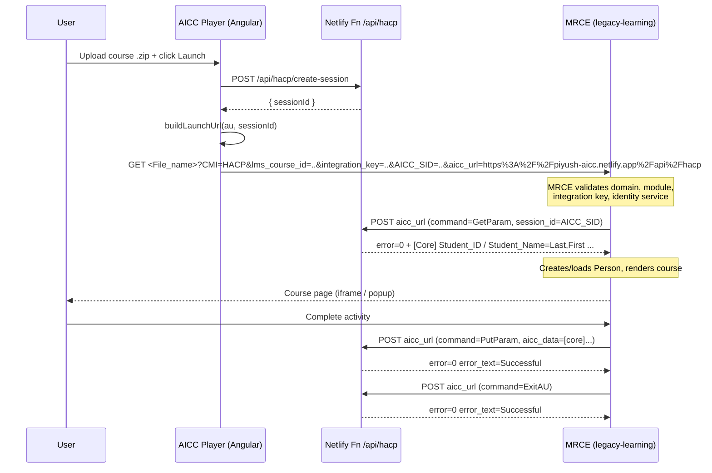

# AICC Player — Full Context & Implementation Guide

A standalone test harness that emulates an **AICC-compliant LMS** so that AICC course
packages generated by **MRCE / Lippincott Learning** can be launched and exercised
end-to-end outside of a real LMS.

- **Stack:** Angular 21 (standalone components, signals) + Netlify serverless functions (Node.js).
- **Hosted at:** `https://piyush-aicc.netlify.app`
- **Purpose:** Upload an AICC `.zip` package → parse it → launch the assignable unit →
  satisfy MRCE's server-side **HACP** callbacks so the course renders and completion
  flows work.

---

## 1. Why this project exists

When MRCE generates an AICC package, the package's `.au` file points its `File_name`
at an MRCE **landing URL** (e.g. `https://legacy-learning.qa.lww.com/aicc/lms/landing`)
and carries a `Web_Launch` query string of:

```
CMI=HACP&lms_course_id=<LMS_ID>&integration_key=<INTEGRATION_KEY>
```

A real LMS would launch that URL, append `AICC_SID` and `aicc_url`, and then **serve
the HACP endpoint** that MRCE calls back into. This project is that "fake LMS": it
generates the session, builds the launch URL, and hosts the HACP endpoint MRCE calls.

---

## 2. The AICC / HACP handshake (end-to-end)



Key point: **MRCE calls the HACP endpoint server-to-server** (from its pods, not the
browser). The `AICC_SID` is the correlation token between the browser-initiated launch
and the MRCE-initiated callback.

---

## 3. Project structure

```
AICC-Player/
├── src/app/
│   ├── course-player/                # Upload UI + launch logic (signals)
│   │   ├── course-player.ts
│   │   ├── course-player.html
│   │   └── course-player.scss
│   ├── services/
│   │   └── aicc.service.ts           # ZIP parsing, .au/.crs/.des parsing, launch URL, session
│   ├── app.routes.ts / app.config.ts / app.ts
├── netlify/functions/hacp.js         # PRODUCTION HACP endpoint (Netlify serverless)
├── deploy/.netlify/functions/hacp.js # Deployed copy of the function (kept in sync)
├── server/hacp-server.js             # LOCAL dev HACP endpoint (Express, port 3000)
├── public/course/                    # Sample AICC package (for manual testing)
├── public/LPDSCT_16733_NUR/          # Real MRCE-generated package sample
├── netlify.toml                      # Build + redirects (/api/hacp → function)
├── proxy.conf.json                   # Dev proxy: /api → localhost:3000
└── angular.json / package.json
```

> ⚠️ There are **three** copies of the HACP logic that must stay in sync:
> `netlify/functions/hacp.js` (source of truth), `deploy/.netlify/functions/hacp.js`
> (deployed copy), and `server/hacp-server.js` (Express dev server). Any protocol
> change must be applied to all three.

---

## 4. The AICC package format (what MRCE generates)

MRCE builds packages in
[`AICCBundle.java`](../MRCE-apps/mrce/src/main/java/com/wolterskluwer/mrce/utils/AICCBundle.java).
A package is a `.zip` containing four files:

### `course.au` (Assignable Unit — the launch descriptor)
```
"System_ID","type","command_line","Max_Time_Allowed","time_limit_action","Max_Score","Core_Vendor","System_Vendor","File_name","Mastery_Score","Web_Launch","AU_Password"
"A1","","","","","","","","<INTEGRATION_URL>","","CMI=HACP&lms_course_id=<LMS_ID>&integration_key=<KEY>",""
```
- **`File_name`** → the MRCE landing URL the player launches.
- **`Web_Launch`** → query params appended at launch (`CMI`, `lms_course_id`, `integration_key`).

### `course.crs` (Course metadata)
```
[Course]
Course_Creator=Wolters Kluwer Health
Course_ID=<LMS_ID>
Course_System=Lippincott Professional Development
Course_Title=<TITLE>
...
[Course_Description]
<DESC>
```

### `course.des` (Descriptor — titles/descriptions per AU)
```
"System_ID","Title","Description","Developer_ID"
"A1","<TITLE>","<DESC>","WKCEConnection"
```

### `course.cst` (Course Structure)
```
"Block","Member","Member","Member"
"Root","A1"
```

The package `moduleId` (folder/zip name) is generated as
`<LMS_ID>_<MODULE_ID>_<NUR|AH>` (focus 2 = NUR, else AH), e.g. `LPDSCT_16733_NUR`.

---

## 5. How the Angular app parses & launches

[`aicc.service.ts`](src/app/services/aicc.service.ts):

- **`parseZip(file)`** — uses JSZip to find `.crs`, `.au`, `.des` (case-insensitive),
  parses them into an `AiccCourse` with `AssignableUnit[]`.
- **CSV parsing** is quote-aware and **header matching is case-insensitive**, so MRCE's
  exact header names (`File_name`, `Web_Launch`, `Mastery_Score`, `System_ID`) all match.
- **`createSession(courseId)`** — `POST /api/hacp/create-session`, returns a `sessionId`.
- **`buildLaunchUrl(au, sessionId)`** — produces:
  ```
  <File_name>?<Web_Launch>&AICC_SID=<sessionId>&aicc_url=<encoded origin + /api/hacp>
  ```
  i.e. `aicc_url=https%3A%2F%2Fpiyush-aicc.netlify.app%2Fapi%2Fhacp`.

[`course-player.ts`](src/app/course-player/course-player.ts) handles drag/drop upload,
the course list, and launches either in a popup window or an embedded iframe
(`bypassSecurityTrustResourceUrl`).

---

## 6. The HACP endpoint contract (what MRCE expects back)

MRCE's HACP client is
[`AICCClient.java`](../MRCE-apps/mrce/src/main/java/com/wolterskluwer/mrce/http/AICCClient.java).
It issues `application/x-www-form-urlencoded` **POST**s to `aicc_url` with:

| Param        | Value                                  |
|--------------|----------------------------------------|
| `command`    | `GetParam` / `PutParam` / `ExitAU`     |
| `version`    | `2.0`                                  |
| `session_id` | the `AICC_SID`                         |
| `aicc_data`  | `[core]` block (PutParam/ExitAU only)  |

### GetParam — MRCE parses the response in `parseLMSPerson()`
Required response shape (the Player returns exactly this):
```
error=0
error_text=Successful
aicc_data=[Core]
Student_ID=<id>
Student_Name=<LastName,FirstName>   ← MUST contain a comma
Credit=credit
Lesson_Status=<status>
Entry=<entry>
Score=<score>
Time=<hhhh:mm:ss.ss>
Lesson_Location=<loc>
Lesson_Mode=normal
[Core_Lesson]
...
[Student_Data]
Mastery_Score=<score>
```

### PutParam / ExitAU
MRCE sends an `aicc_data` `[core]` block with `lesson_status`, optional `score`, `time`.
The Player just needs to acknowledge:
```
error=0
error_text=Successful
```

---

## 7. ⚠️ Critical gotchas (these caused real 403s — keep them fixed)

### 7.1 `Student_Name` MUST be `LastName,FirstName` (comma-separated)
MRCE's `parseLMSPerson()` does:
```java
String[] names = StringUtils.split(studentName, ",");
if (Objects.nonNull(names[1])) { ... }   // ArrayIndexOutOfBoundsException if no comma
```
A name without a comma (`"Test Student"`) throws `ArrayIndexOutOfBoundsException` →
unhandled → resolver renders the **403 "This resource is not accessible."** page.

**Fix in place:** `toAiccName()` in all three HACP handlers guarantees a comma
(`"Test, Student"`), and `create-session` / Angular default to `"Test, Student"`.
**Never** emit a `Student_Name` without a comma.

### 7.2 Serverless cold-starts lose in-memory sessions
Netlify functions are stateless; the instance that handled `create-session` is usually
**not** the one MRCE calls back for `GetParam`/`PutParam`/`ExitAU`. The in-memory
`sessions` Map is empty there.

**Fix in place:** `GetParam` falls back to a valid **default session** when the id is
missing, and `PutParam`/`ExitAU` **always** return `error=0` (never `error=1`).
A real production deployment should back sessions with a shared store (Netlify Blobs,
Redis, or a DB) if persisted progress is needed.

### 7.3 MRCE-side preconditions for a successful launch
These are **MRCE/DB-side** requirements (not the Player's). All four must hold for the
landing to render instead of 403:

1. **Domain whitelist** — the host of `aicc_url` (e.g. `piyush-aicc.netlify.app`) must
   exist in the `AICC_DOMAIN` table as a **bare host** (no scheme, no trailing slash).
   `AICCStepController.parseReferer()` extracts only the hostname and does an exact
   match in `ensureByDomain()`.
2. **Module lookup** — `lms_course_id` must match `MODULE.LMS_ID` **and**
   `IS_PUBLISHED = 1` **and** `FOCUS ∈ {1 (AH), 2 (Nursing)}` (on the Lippincott
   Learning platform). See `selectModuleIdByLMSId()`.
3. **Integration key** — must match an institution
   (`INSTITUTION.getInstitutionByIntegrationKey()`); also added to the institution's
   WhiteList URLs in the admin UI.
4. **Identity service** — `IDENTITY_SERVICE` must contain exactly one row named
   `Lippincott Learning` (LL platform) or `Nursing Center` (NUR/AH). A missing or
   duplicate row → `AICCException(403, "Invalid Identity")`.

---

## 8. Configuration & routing

### `netlify.toml`
```toml
[build]
  command = "npm run build"
  publish = "dist/aicc-player/browser"
  functions = "netlify/functions"

[[redirects]]                # API → serverless function
  from = "/api/hacp/*"
  to = "/.netlify/functions/hacp"
  status = 200
[[redirects]]
  from = "/api/hacp"
  to = "/.netlify/functions/hacp"
  status = 200
[[redirects]]                # SPA fallback (must be last)
  from = "/*"
  to = "/index.html"
  status = 200
```

### `proxy.conf.json` (dev only)
```json
{ "/api": { "target": "http://localhost:3000", "secure": false, "pathRewrite": { "^/api": "" } } }
```
Run the dev HACP server with `node server/hacp-server.js` (Express, port 3000) when
using `ng serve`.

---

## 9. Local development

```powershell
cd AICC-Player
npm install

# Terminal 1 — local HACP endpoint (mirrors the Netlify function)
node server/hacp-server.js

# Terminal 2 — Angular dev server (proxies /api → :3000)
ng serve
# open http://localhost:4200
```

> Note: for an MRCE-generated package to actually render, MRCE must be able to reach
> the `aicc_url` you pass. `localhost` is not reachable from MRCE pods — use the
> deployed Netlify URL for real end-to-end MRCE testing.

## 10. Build & deploy

```powershell
cd AICC-Player
npm run build                 # → dist/aicc-player/browser
netlify deploy --prod         # deploys site + netlify/functions/hacp.js
```

After deploy, generate/refresh a package whose `.au` points at the right MRCE
environment, upload it in the Player, and click **Launch**.

---

## 11. End-to-end test checklist

- [ ] Package `.au` `File_name` points at the correct MRCE env landing URL.
- [ ] `lms_course_id` exists in `MODULE.LMS_ID`, `IS_PUBLISHED=1`, `FOCUS` in {1,2}.
- [ ] `integration_key` matches the target institution.
- [ ] Player host (`piyush-aicc.netlify.app`) is in `AICC_DOMAIN` as a bare host.
- [ ] `IDENTITY_SERVICE` has the right single row for the platform.
- [ ] Netlify function deployed with the latest `Student_Name` + session fixes.
- [ ] Launch → no 403; course renders; completion `PutParam`/`ExitAU` return `error=0`.

---

## 12. Troubleshooting map (symptom → cause)

| Symptom (browser / inspector)                         | Real cause                                                                 |
|-------------------------------------------------------|---------------------------------------------------------------------------|
| 403 "You are unauthorized to access this page" (501)  | `aicc_url` host not whitelisted in `AICC_DOMAIN` (or stored with scheme/slash). |
| 403 "This resource is not accessible." (errors/403)   | Either `AICCException(403,"Invalid Identity")` **or** an unhandled exception in `parseLMSPerson` (e.g. `Student_Name` without a comma). Check MRCE pod logs. |
| HTTP 200 but blank/Invalid course                     | `selectModuleIdByLMSId` returned null (not published / wrong focus / wrong LMS_ID). |
| 500 / "Error parsing the AICC Response"               | HACP `GetParam` response malformed or missing `Student_ID`/`Student_Name`. |
| Course renders but progress not saved                 | Session lost on serverless cold-start (expected with in-memory store).    |

**Always confirm via MRCE pod logs.** Distinct log markers pinpoint the branch:
`referer=...` + `identityService=null` (identity), `Invalid course Id <X>` (module),
`No Student ID was provided from the LMS Server` (HACP callback),
`UnAuthorized AICC IntegrationKey` (integration key), or a stack trace at
`AICCClient.parseLMSPerson(...)` (response parsing, e.g. the comma bug).
