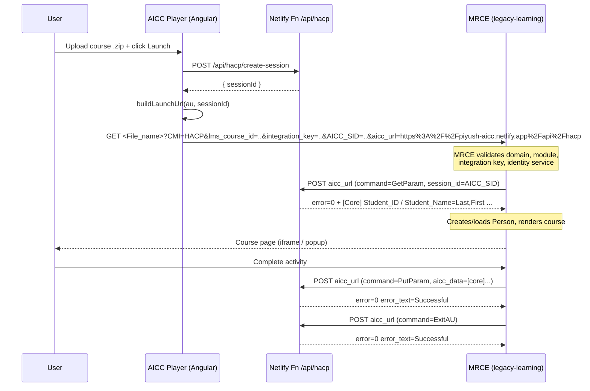

# AICC Player — Full Context & Implementation Guide

A standalone test harness that emulates an **AICC-compliant LMS** so that AICC course
packages generated by **MRCE / Lippincott Learning** can be launched and exercised
end-to-end outside of a real LMS.

- **Stack:** Angular 21 (standalone components, signals) + Netlify serverless functions (Node.js).
- **Hosted at:** `https://piyush-aicc.netlify.app`
- **Purpose:** Upload an AICC `.zip` package → parse it → launch the assignable unit →
  satisfy MRCE's server-side **HACP** callbacks so the course renders and completion
  flows work.

---

## 1. Why this project exists

When MRCE generates an AICC package, the package's `.au` file points its `File_name`
at an MRCE **landing URL** (e.g. `https://legacy-learning.qa.lww.com/aicc/lms/landing`)
and carries a `Web_Launch` query string of:

```
CMI=HACP&lms_course_id=<LMS_ID>&integration_key=<INTEGRATION_KEY>
```

A real LMS would launch that URL, append `AICC_SID` and `aicc_url`, and then **serve
the HACP endpoint** that MRCE calls back into. This project is that "fake LMS": it
generates the session, builds the launch URL, and hosts the HACP endpoint MRCE calls.

---

## 2. The AICC / HACP handshake (end-to-end)



Key point: **MRCE calls the HACP endpoint server-to-server** (from its pods, not the
browser). The `AICC_SID` is the correlation token between the browser-initiated launch
and the MRCE-initiated callback.

---

## 3. Project structure

```
AICC-Player/
├── src/app/
│   ├── course-player/                # Upload UI + launch logic (signals)
│   │   ├── course-player.ts
│   │   ├── course-player.html
│   │   └── course-player.scss
│   ├── services/
│   │   └── aicc.service.ts           # ZIP parsing, .au/.crs/.des parsing, launch URL, session
│   ├── app.routes.ts / app.config.ts / app.ts
├── netlify/functions/hacp.js         # PRODUCTION HACP endpoint (Netlify serverless)
├── deploy/.netlify/functions/hacp.js # Deployed copy of the function (kept in sync)
├── server/hacp-server.js             # LOCAL dev HACP endpoint (Express, port 3000)
├── public/course/                    # Sample AICC package (for manual testing)
├── public/LPDSCT_16733_NUR/          # Real MRCE-generated package sample
├── netlify.toml                      # Build + redirects (/api/hacp → function)
├── proxy.conf.json                   # Dev proxy: /api → localhost:3000
└── angular.json / package.json
```

> ⚠️ There are **three** copies of the HACP logic that must stay in sync:
> `netlify/functions/hacp.js` (source of truth), `deploy/.netlify/functions/hacp.js`
> (deployed copy), and `server/hacp-server.js` (Express dev server). Any protocol
> change must be applied to all three.

---

## 4. The AICC package format (what MRCE generates)

MRCE builds packages in
[`AICCBundle.java`](../MRCE-apps/mrce/src/main/java/com/wolterskluwer/mrce/utils/AICCBundle.java).
A package is a `.zip` containing four files:

### `course.au` (Assignable Unit — the launch descriptor)
```
"System_ID","type","command_line","Max_Time_Allowed","time_limit_action","Max_Score","Core_Vendor","System_Vendor","File_name","Mastery_Score","Web_Launch","AU_Password"
"A1","","","","","","","","<INTEGRATION_URL>","","CMI=HACP&lms_course_id=<LMS_ID>&integration_key=<KEY>",""
```
- **`File_name`** → the MRCE landing URL the player launches.
- **`Web_Launch`** → query params appended at launch (`CMI`, `lms_course_id`, `integration_key`).

### `course.crs` (Course metadata)
```
[Course]
Course_Creator=Wolters Kluwer Health
Course_ID=<LMS_ID>
Course_System=Lippincott Professional Development
Course_Title=<TITLE>
...
[Course_Description]
<DESC>
```

### `course.des` (Descriptor — titles/descriptions per AU)
```
"System_ID","Title","Description","Developer_ID"
"A1","<TITLE>","<DESC>","WKCEConnection"
```

### `course.cst` (Course Structure)
```
"Block","Member","Member","Member"
"Root","A1"
```

The package `moduleId` (folder/zip name) is generated as
`<LMS_ID>_<MODULE_ID>_<NUR|AH>` (focus 2 = NUR, else AH), e.g. `LPDSCT_16733_NUR`.

---

## 5. How the Angular app parses & launches

[`aicc.service.ts`](src/app/services/aicc.service.ts):

- **`parseZip(file)`** — uses JSZip to find `.crs`, `.au`, `.des` (case-insensitive),
  parses them into an `AiccCourse` with `AssignableUnit[]`.
- **CSV parsing** is quote-aware and **header matching is case-insensitive**, so MRCE's
  exact header names (`File_name`, `Web_Launch`, `Mastery_Score`, `System_ID`) all match.
- **`createSession(courseId)`** — `POST /api/hacp/create-session`, returns a `sessionId`.
- **`buildLaunchUrl(au, sessionId)`** — produces:
  ```
  <File_name>?<Web_Launch>&AICC_SID=<sessionId>&aicc_url=<encoded origin + /api/hacp>
  ```
  i.e. `aicc_url=https%3A%2F%2Fpiyush-aicc.netlify.app%2Fapi%2Fhacp`.

[`course-player.ts`](src/app/course-player/course-player.ts) handles drag/drop upload,
the course list, and launches either in a popup window or an embedded iframe
(`bypassSecurityTrustResourceUrl`).

---

## 6. The HACP endpoint contract (what MRCE expects back)

MRCE's HACP client is
[`AICCClient.java`](../MRCE-apps/mrce/src/main/java/com/wolterskluwer/mrce/http/AICCClient.java).
It issues `application/x-www-form-urlencoded` **POST**s to `aicc_url` with:

| Param        | Value                                  |
|--------------|----------------------------------------|
| `command`    | `GetParam` / `PutParam` / `ExitAU`     |
| `version`    | `2.0`                                  |
| `session_id` | the `AICC_SID`                         |
| `aicc_data`  | `[core]` block (PutParam/ExitAU only)  |

### GetParam — MRCE parses the response in `parseLMSPerson()`
Required response shape (the Player returns exactly this):
```
error=0
error_text=Successful
aicc_data=[Core]
Student_ID=<id>
Student_Name=<LastName,FirstName>   ← MUST contain a comma
Credit=credit
Lesson_Status=<status>
Entry=<entry>
Score=<score>
Time=<hhhh:mm:ss.ss>
Lesson_Location=<loc>
Lesson_Mode=normal
[Core_Lesson]
...
[Student_Data]
Mastery_Score=<score>
```

### PutParam / ExitAU
MRCE sends an `aicc_data` `[core]` block with `lesson_status`, optional `score`, `time`.
The Player just needs to acknowledge:
```
error=0
error_text=Successful
```

---

## 7. ⚠️ Critical gotchas (keep these intact)

### 7.1 `Student_Name` MUST be `LastName,FirstName` (comma-separated)
MRCE's `parseLMSPerson()` does:
```java
String[] names = StringUtils.split(studentName, ",");
if (Objects.nonNull(names[1])) { ... }   // ArrayIndexOutOfBoundsException if no comma
```
A name without a comma (`"Test Student"`) throws `ArrayIndexOutOfBoundsException` in
MRCE's response parser.

**Fix in place:** `toAiccName()` in all three HACP handlers guarantees a comma
(`"Test, Student"`), and `create-session` / Angular default to `"Test, Student"`.
**Never** emit a `Student_Name` without a comma.

### 7.2 Serverless cold-starts lose in-memory sessions
Netlify functions are stateless; the instance that handled `create-session` is usually
**not** the one MRCE calls back for `GetParam`/`PutParam`/`ExitAU`. The in-memory
`sessions` Map is empty there.

**Fix in place:** `GetParam` falls back to a valid **default session** when the id is
missing, and `PutParam`/`ExitAU` **always** return `error=0` (never `error=1`).
A real production deployment should back sessions with a shared store (Netlify Blobs,
Redis, or a DB) if persisted progress is needed.

### 7.3 MRCE-side preconditions for a successful launch
These are **MRCE/DB-side** requirements (not the Player's). All four must hold for the
landing to render the course:

1. **Domain whitelist** — the host of `aicc_url` (e.g. `piyush-aicc.netlify.app`) must
   exist in the `AICC_DOMAIN` table as a **bare host** (no scheme, no trailing slash).
   `AICCStepController.parseReferer()` extracts only the hostname and does an exact
   match in `ensureByDomain()`.
2. **Module lookup** — `lms_course_id` must match `MODULE.LMS_ID` **and**
   `IS_PUBLISHED = 1` **and** `FOCUS ∈ {1 (AH), 2 (Nursing)}` (on the Lippincott
   Learning platform). See `selectModuleIdByLMSId()`.
3. **Integration key** — must match an institution
   (`INSTITUTION.getInstitutionByIntegrationKey()`); also added to the institution's
   WhiteList URLs in the admin UI.
4. **Identity service** — `IDENTITY_SERVICE` must contain exactly one row named
   `Lippincott Learning` (LL platform) or `Nursing Center` (NUR/AH).

---

## 8. Configuration & routing

### `netlify.toml`
```toml
[build]
  command = "npm run build"
  publish = "dist/aicc-player/browser"
  functions = "netlify/functions"

[[redirects]]                # API → serverless function
  from = "/api/hacp/*"
  to = "/.netlify/functions/hacp"
  status = 200
[[redirects]]
  from = "/api/hacp"
  to = "/.netlify/functions/hacp"
  status = 200
[[redirects]]                # SPA fallback (must be last)
  from = "/*"
  to = "/index.html"
  status = 200
```

### `proxy.conf.json` (dev only)
```json
{ "/api": { "target": "http://localhost:3000", "secure": false, "pathRewrite": { "^/api": "" } } }
```
Run the dev HACP server with `node server/hacp-server.js` (Express, port 3000) when
using `ng serve`.

---

## 9. Local development

```powershell
cd AICC-Player
npm install

# Terminal 1 — local HACP endpoint (mirrors the Netlify function)
node server/hacp-server.js

# Terminal 2 — Angular dev server (proxies /api → :3000)
ng serve
# open http://localhost:4200
```

> Note: for an MRCE-generated package to actually render, MRCE must be able to reach
> the `aicc_url` you pass. `localhost` is not reachable from MRCE pods — use the
> deployed Netlify URL for real end-to-end MRCE testing.

## 10. Build & deploy

```powershell
cd AICC-Player
npm run build                 # → dist/aicc-player/browser
netlify deploy --prod         # deploys site + netlify/functions/hacp.js
```

After deploy, generate/refresh a package whose `.au` points at the right MRCE
environment, upload it in the Player, and click **Launch**.

---

## 11. End-to-end test checklist

- [ ] Package `.au` `File_name` points at the correct MRCE env landing URL.
- [ ] `lms_course_id` exists in `MODULE.LMS_ID`, `IS_PUBLISHED=1`, `FOCUS` in {1,2}.
- [ ] `integration_key` matches the target institution.
- [ ] Player host (`piyush-aicc.netlify.app`) is in `AICC_DOMAIN` as a bare host.
- [ ] `IDENTITY_SERVICE` has the right single row for the platform.
- [ ] Netlify function deployed with the latest `Student_Name` + session fixes.
- [ ] Launch → course renders; completion `PutParam`/`ExitAU` return `error=0`.

---

## 12. Troubleshooting map (symptom → cause)

| Symptom (browser / inspector)                         | Real cause                                                                 |
|-------------------------------------------------------|---------------------------------------------------------------------------|
| HTTP 200 but blank/Invalid course                     | `selectModuleIdByLMSId` returned null (not published / wrong focus / wrong LMS_ID). |
| 500 / "Error parsing the AICC Response"               | HACP `GetParam` response malformed or missing `Student_ID`/`Student_Name`. |
| Course renders but progress not saved                 | Session lost on serverless cold-start (expected with in-memory store).    |

**Always confirm via MRCE pod logs.** Distinct log markers pinpoint the branch:
`referer=...` + `identityService=null` (identity), `Invalid course Id <X>` (module),
`No Student ID was provided from the LMS Server` (HACP callback),
`UnAuthorized AICC IntegrationKey` (integration key), or a stack trace at
`AICCClient.parseLMSPerson(...)` (response parsing, e.g. the comma bug).

---

## 13. NS-25485 Investigation — Cornerstone LMS "refused to connect"

### Jira Ticket
- **Key:** NS-25485
- **Summary:** LL: Users are encountering an error when attempting to view the course within their LMS
- **SF Case:** 07124147
- **Institution:** Mosaic Life Care
- **LMS:** Cornerstone (`mymlc.csod.com`)
- **Affected Users:** Cori Criger, Karen Christians Parham, Jackie Vertin
- **Integration Key:** `hj8cdjvh3kxr3`
- **LMS Course ID:** `CC00250`

### The Error (Screenshot from user)
The user sees: **"nursing.ceconnection.com refused to connect."** — a browser-level
connection refusal displayed inside Cornerstone's training player iframe at:
```
https://mymlc.csod.com/ui/training/app/targetUser/48624/trainingID/56cbaa70-f667-4b1c-965e-4e16203c3f35?trainingType=Course&action=2&isM6ILT=true&isOCSE=true&isSTROA=true&isUFE=true&isIPOCE=true
```

### Production Log Analysis (May 27, 2026 ~15:48 UTC / 21:18 IST)

Logs from New Relic (`CEC_ll` entity) confirm:

#### Jackie Vertin (student_id: 24872)
- **15:48:05.549** — Landing hit: `aicc_url=https://mymlc.csod.com/LMS/scorm/aicc.aspx`, `integration_key=hj8cdjvh3kxr3`, `lms_course_id=CC00250`
- **15:48:08.121** — AICC GetParam succeeds: `error=0`, `student_name=Vertin,Jackie`, `lesson_status=incomplete`, `score=70`, `attempt_number=2`
- **15:48:08.258** — Temp username created: `Jackie.Vertin.67916`
- **15:48:08.500** — Person resolved: `personId=937443`, `institutionId=68188`
- **15:48:09.086** — View rendered: `aicc/aiccLmsTemplate` ✅

#### Karen Christians Parham (student_id: 7348)
- **15:48:53.970** — Landing hit: same integration_key, `aicc_sid=AICCQbGMo8HLL14o0rx9ETTf9w`
- **15:48:54.328** — AICC GetParam succeeds: `error=0`, `student_name=Christians Parham,Karen`, `lesson_status=passed`, `score=80`
- **15:48:54.429** — Temp username: `Karen.ChristiansParham.40427`
- **15:49:09.140** — View rendered: `aicc/aiccLmsTemplate` ✅

#### Key log observations
- **No `PermissionDeniedException`** — `csod.com` IS whitelisted in `AICC_DOMAIN` table
- **No `AICCException("UnAuthorized AICC Domain")`** — domain validation passes
- **AICC handshake succeeds** server-to-server (`error=0, error_text=successful`)
- **Template renders** — `aiccLmsTemplate.jsp` is returned to the browser
- The server-side is working perfectly. The failure is client-side/browser-side.

### Two AICC Launch Paths in MRCE

| Path | Controller Method | Behavior | Used By |
|------|-------------------|----------|---------|
| `/nu/aicc/lms/landing` | `viewAICCLanding()` | Opens in **new browser window/tab** | Workday (`wd5-media.myworkdaycdn.com`) |
| `/aicc/lms/landing` | `viewAICCLMSLanding()` | Returns `aiccLmsTemplate.jsp` — loaded **inside iframe** | Cornerstone (`mymlc.csod.com`), Clark County (`ns2cloud.com`) |

### Why the error occurs (architecture)

`aiccLmsTemplate.jsp` (line ~186) contains:
```html
<iframe src="" id="targetIFrame" name="targetIFrame" onload="Landing.frameLoad();"
        frameborder="0" scrolling="yes" width="900" height="650"></iframe>
```

**Cornerstone's nesting:**
```
Cornerstone (mymlc.csod.com) SPA
  └─ iframe → nursing.ceconnection.com/aicc/lms/landing (aiccLmsTemplate.jsp)
       └─ iframe (targetIFrame) → nursing.ceconnection.com/nu/aicc/lms/steps/...
```

**Workday's approach (works fine):**
```
Workday opens → NEW WINDOW → nursing.ceconnection.com/nu/aicc/lms/landing
  └─ iframe (targetIFrame) → nursing.ceconnection.com/nu/aicc/lms/steps/...
```
No parent iframe = no cross-origin nesting = cookies flow normally.

### Domain validation code paths

1. **`AICC_DOMAIN` DB table** — `AICCStepController.isValidDomain()` calls `aiccDomainDAO.ensureByDomain(referer)`. If domain not found → `AICCException("UnAuthorized AICC Domain")`
2. **`aicc-allowed-domains` in mrce-configuration.xml** — `MRCEConfiguration.isAICCDomainAllowed()` extracts the top private domain using Guava's `InternetDomainName` and checks against the config list. If not found → `PermissionDeniedException("You cannot access this resource.")`

### Why we could NOT reproduce

- **Ramananda tested** with the customer's AICC zip file and a freshly downloaded package → works fine (because not inside Cornerstone's iframe)
- **Piyush tested** with the AICC Player project in both iframe and "Cornerstone Mode" (blob URL nested iframe simulation) → works fine
- **Conclusion:** The blob URL approach doesn't fully replicate Cornerstone's environment because it still shares origin context. The real issue is environment-specific.

### Cornerstone Mode Feature (added to AICC Player)

A **"🏢 Cornerstone LMS Mode"** toggle was added to the Player to attempt reproduction:
- Creates a blob URL HTML page mimicking Cornerstone's UI (header, toolbar)
- Embeds the AICC launch URL in a nested iframe with `sandbox` attributes
- Visually indicates Cornerstone simulation with purple badge and border
- Close button uses `postMessage` to communicate with parent frame
- **Result:** Could not reproduce the "refused to connect" error — confirming the issue is customer-environment specific

### Root Cause Assessment

Since the MRCE backend processes the request successfully and the error cannot be reproduced in any test environment, the "refused to connect" is caused by one or more of:

| Possible Cause | Explanation |
|---|---|
| **Corporate proxy/firewall** | Mosaic Life Care's network blocks `nursing.ceconnection.com` when accessed as a sub-resource inside `csod.com` iframe |
| **Cornerstone's CSP headers** | Cornerstone may set restrictive `Content-Security-Policy: frame-src` that excludes `nursing.ceconnection.com` — this is admin-configured |
| **Browser third-party cookie blocking** | Chrome's SameSite=Lax default + nested cross-origin iframes prevent JSESSIONID from being set |
| **Enterprise Chrome policies** | Managed browser can block third-party iframe content |
| **DNS/network intermittent failure** | TCP-level "refused to connect" suggests connection never established |

### Jira Comments Posted

1. **Comment 1 (Jun 2):** Full technical analysis — logs confirm backend works, root cause is browser-side nested iframe cookie/network issue, suggested fix is to configure Cornerstone to open in new window
2. **Comment 2 (Jun 2):** Asked customer to verify if Cornerstone opens content in iframe or new window, and to try another package

### Recommended Actions (for the customer)

1. Check Cornerstone admin → Content Player settings → change "Open In" to **new window/popup**
2. Ask IT to whitelist `nursing.ceconnection.com` in corporate proxy/firewall
3. Try from a non-corporate network (personal hotspot) to confirm network-related
4. Check if Chrome enterprise policies restrict third-party iframe content

### Files Involved

- `MRCE-apps/mrce/src/main/java/com/wolterskluwer/mrce/controller/AICCStepController.java` — AICC landing & step controllers
- `MRCE-apps/mrce/src/main/java/com/wolterskluwer/mrce/web/MRCEConfiguration.java` — `isAICCDomainAllowed()`
- `MRCE-apps/mrce/src/main/java/com/wolterskluwer/mrce/dao/AICCDomainDAO.java` — DB domain whitelist
- `MRCE-apps/mrce/src/main/webapp/WEB-INF/views/aicc/aiccLmsTemplate.jsp` — the rendered template with `targetIFrame`
- `MRCE-apps/mrce/src/main/webapp/WEB-INF/views/aicc/aiccContentTemplate.jsp` — content loaded inside targetIFrame
- `MRCE-apps/mrce/src/main/webapp/WEB-INF/web.xml` — filter mappings (thirdPartyCookieFilter on `/aicc/*`)
- `MRCE-apps/mrce/src/main/resources/security-context.xml` — Spring Security config
- `MRCE-apps/mrce/src/test/resources/mrce-configuration.xml` — `<aicc-allowed-domains>` config
